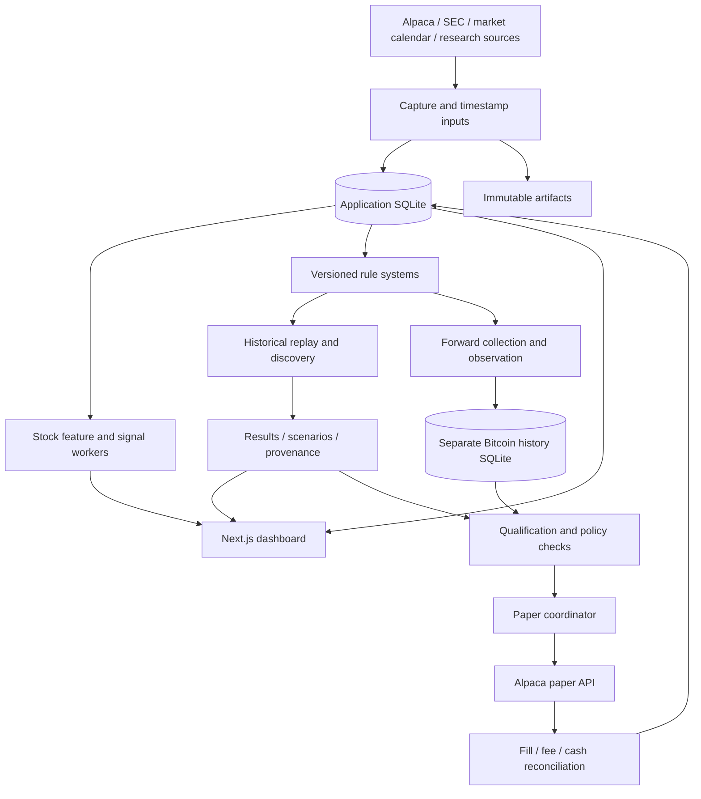

# StockWatch

## Coinbase Live Price and Telegram manual paper trading

The new implementation adds Coinbase ticker/heartbeat streaming above the Bitcoin
chart, one manual paper account with separate stock and Bitcoin budgets, and a shared Telegram/browser workspace,
confirmation-bound order intents, conditional/stop-limit instructions, protective
exit plans, supported-template system controls, a notification outbox, and worker
preflight/accounting corrections. See the full [live pricing and paper operations
guide](docs/live-paper-operations.md) for commands, architecture, setup, recovery,
retention, source/quote distinctions, accounting limits, deployment, and rollback.
The companion integration is in [Autobot](https://github.com/mjm2z/autobot).

Installation and credentials are separate from source availability. Manual trading
is unconfigured until one dedicated paper account and its separate $1,000 stock
and Bitcoin budgets and $100 entry cap setup preview are confirmed. No account resets, strategy activation, or paper test
trades occur just by installing. The [September 28 release report](docs/live-paper-release-2026-09-28.md)
records actual deployment state and remaining work.


StockWatch is a self-hosted market research and **paper-trading** application. It combines a stock scanner, timestamped research inputs, historical experiments, configurable rule systems, Bitcoin charts, forward observation, and separately attributed paper execution.

The application is designed to keep the reasoning behind a decision inspectable. A score is not a probability of profit; a successful job is not necessarily a winning backtest; a simulated trade is not a broker fill. These distinctions apply throughout this document and the UI.

The current application host is **a1347-m**. The Mac is a development machine. The LAN application address is **http://stockwatch.home.arpa:3001**. A GitHub commit does not update that host by itself: installation, migration, and service verification are separate steps.

## Contents

- [Correctness release 1](#correctness-release-1)
- [User workflow and navigation](#user-workflow-and-navigation)
- [Architecture and data ownership](#architecture-and-data-ownership)
- [Stock research and signal scoring](#stock-research-and-signal-scoring)
- [Signal outcomes versus portfolio performance](#signal-outcomes-versus-portfolio-performance)
- [Systems and visual rules](#systems-and-visual-rules)
- [Historical backtesting](#historical-backtesting)
- [Bitcoin research library](#bitcoin-research-library)
- [Nightly discovery and proposals](#nightly-discovery-and-proposals)
- [Automatic Bitcoin paper qualification](#automatic-bitcoin-paper-qualification)
- [Paper execution and risk](#paper-execution-and-risk)
- [Charts and blockchain monitoring](#charts-and-blockchain-monitoring)
- [API and persistence reference](#api-and-persistence-reference)
- [Configuration and local development](#configuration-and-local-development)
- [Deployment, monitoring, and recovery](#deployment-monitoring-and-recovery)
- [Verification and research limitations](#verification-and-research-limitations)
- [Code and documentation map](#code-and-documentation-map)

## Correctness release 1

This stage adds measurement and diagnostics under migration **020_correctness**. It does not change published strategy hashes, scanner thresholds, automatic Bitcoin qualification, budget limits, ownership, or execution schedules. Later research-validation and UI stages remain separate work. Resource changes are bounded SQLite reporting writes, up to four scan backfills per research tick, and at most one Bitcoin account mark per minute; there is no new paid service or additional periodic broker request. Historical backfill adds no network traffic. See the [code-backed audit and remaining dependencies](docs/correctness-release-audit.md).

### Stock data identity and coverage

The established collector explicitly requests Alpaca **IEX**, daily bars, `adjustment=all`. IEX is a single-exchange feed; its dollar volume is not consolidated-market dollar volume. Existing absolute-volume thresholds remain an identified interpretation limitation. They are not lowered or silently recalibrated in this release.

New ingestions retain provider, feed, venue, adjustment, interval, ingestion identity, and retrieval-based provenance. `market_series` identifies these dimensions. Non-IEX historical observations are isolated in `market_observations`, including content hashes and revisions; they cannot overwrite the legacy IEX bar key. Historical source availability is unknown unless retained, not inferred from the bar's date. Existing frozen scan payloads/revision records remain authoritative for published scanner decisions. Old rows are not retroactively assigned a guessed feed.

Operations → **Data sources and qualification limitations** and `GET /api/systems/capabilities` show the latest 20 dataset manifests, observed series, and explicit verified/approximate/unavailable capabilities for membership, sectors, delistings, splits, dividends, spin-offs, symbol identity, volume adjustments, missing sessions, and revisions. A verified claim requires retained evidence; an approximate claim requires its reason. These are evidence declarations, not a new independent validation engine. Unverified stock datasets remain research-only. Requesting adjusted bars alone does not verify corporate actions or survivorship coverage.

A bounded read-only probe, `deploy/check-data-capabilities.py`, compares AAPL daily IEX/SIP access and last-session volume over a seven-day historical request ending two days ago. It reads `ALPACA_API_KEY_ID` and `ALPACA_API_SECRET_KEY` from the protected service environment and prints no credentials. Running this probe does not switch feeds, place orders, or purchase access. Actual account entitlement must be checked before planning a versioned consolidated-feed strategy.

### Scan explanations and fundamentals shadow report

Operations → **Scan decisions and coverage**, or `GET /api/dashboard/scans?id=<scan-id>`, distinguishes unique instruments from horizon assessments, legacy weighted-pillar coverage, score-qualified assessments, qualification after vetoes, allowed entry checks, submitted orders, and orders with fills. Primary outcomes count each retained assessment exactly once; secondary reasons can overlap. Candidate failures are separate from retained assessments. Coverage here is the published score's completeness test, not proof every underlying feature exists. A missing order intent does not establish execution eligibility.

Diagnostics use the frozen strategy configuration and are captured after a scan; their capture time is shown. Later fills are not retroactively added to that snapshot. The research worker also captures up to four older completed scans per `run-next` invocation using retained data, without a network re-fetch. Historical diagnostics describe records available when captured. Reporting failures are logged and cannot change the scan's trading result.

`fundamentals-review-v2` is a **shadow-only** report stored in `source_provenance`; the last five reports are inspectable in Operations and the capabilities API. It preserves selected CompanyFacts document/hash, accessions, fiscal periods, USD concepts, filing identities, and decision cutoff. It uses explicit timezone-aware acceptance timestamps where supplied; date-only filings wait until the next retained exchange opening after the filing date. Unknown calendar availability remains unavailable. Compatible cumulative fiscal periods are differenced into quarters and four adjacent quarters form TTM values. Insufficient periods or inconsistent metric periods are reported, not filled. This does not replace the existing published annual feature calculation or fabricate historical SEC vintages.

### Account returns versus fill cohorts

`performance.py` owns prospective **account-unitized-observations-v1** measurements. Both Stocks and Crypto use `GET /api/dashboard/performance?asset=stocks|bitcoin` and the same stored result/return-index chart. A result includes account scope and owner, period, as-of timestamp, observation count, method, cash/equity, return, observed drawdown, and unavailable reasons. Account measurements are separate from sleeve metrics and legacy scanner fill cohorts.

Stock marks are recorded after the existing broker reconciliation; Bitcoin marks are limited to one per minute after registered-account reconciliation. No new broker calls are introduced by measurement. An unregistered Bitcoin account has no measurements even if credentials exist. Dollar equity comes from the actual paper broker, including idle cash. Stock external cash activities and reconciled Bitcoin cash-flow records are kept distinct from internal purchases, sales, allocations, dividends, and fees.

The return index starts at 100. A complete no-flow interval links by ending/beginning equity. A verified flow at the ending valuation links by `(ending equity - external flow) / beginning equity`. A flow between retained marks, unknown cash activity, late external activity, unreconciled account, or missing flow-event valuation makes the full-period return unavailable. Net-zero flows still need event valuations. This is conservative observed-snapshot accounting, not a claim of continuous intraday valuation or GIPS compliance. There is no automatic baseline reset after a broken interval. Historical snapshots are not invented. Maximum drawdown uses the running full-resolution return index and peak; between-observation drawdowns remain unknown.

The interactive chart shows the latest 500 marks with hover and keyboard inspection, breaks unavailable intervals, and does not recompute headline metrics from the display window. A matching account-funded benchmark and sleeve-level unitization are **not yet available**. Their absence does not become zero return. Broker paper dividends are not invented as cash; any future economic total-return simulation needs a separate ledger and matching benchmark convention.

The retained **legacy fill-cohort** view measures scanner-owned lots against accumulated entry cost and a matched entry-cost SPY bar-price proxy. Each purchase adds capital to this constructed cohort; it is not an external account deposit. Idle broker cash is excluded. Realized and unrealized P/L have separate cards. The secondary equity chart now labels accumulated entry cost explicitly. Its SPY proxy is not a funding-matched whole-account total-return benchmark.

## Correctness release closeout (September 27, 2026)

The authoritative a1347-m receipt identifies **62bcffd3090fdb4ccebf08ebc9c9ec84076528e8**, installed September 27 at 20:16 UTC. Migration 020 ran through the database-changing path, with fresh verified recovery at `/var/backups/stock-watch-releases/20260927T144107Z` and retained runtime `/opt/stock-watch.before-20260927T144107Z`. The installer exited successfully. The subsequent closeout changes affect deployment tooling/tests/documentation, not application code; they do not require reinstalling this runtime. The later local DNS-installer change is likewise not evidence of a new deployed application revision.

Application availability and worker readiness are separate. At 20:40 UTC, the operator-run protected report confirmed schema versions 001–020, recorded backup verification, both recovery database files and a manifest of 11,102 artifacts; 133 selected installed files matched the reviewed manifest. `/api/health` returned `ok`, while research readiness remained HTTP 503 for six blocked **stock** trials. Stock exits and Bitcoin automation services had recent successful executions. An idle oneshot service between timer executions is normal.

The same report confirmed raw daily bars are absent, while adjusted bars, universe, calendar and sector data are present. This explains why the raw-data exporter has no usable rows; adjusted bars must not be substituted silently. All six Bitcoin candidates failed qualification (15–30% scenario pass rates versus 80% required, insufficient unique trades and negative-return/cost-profile failures), so no Bitcoin allocations or authorizations exist. GET-only broker observations verified distinct stock/Bitcoin accounts, a matching registered stock identity, an empty Bitcoin account and no open orders in either account. The Bitcoin account is not yet registered locally; this is consistent with deferred initialization until a candidate passes. Stored stock reconciliation is matched **as of September 25 at 21:15 UTC**, not a fresh post-install reconciliation. Seven open stock lots and two broker positions have different scopes; their counts alone neither prove nor disprove quantity agreement. Full fill/fee and quantity/cash reconciliation remains outside this snapshot report.

The scanner collector requests `adjustment=all`; visual stock dataset export explicitly selects `adjustment=raw` and requires sector/calendar joins. Its generic missing-input error does not establish which prerequisite is missing. Inspect raw versus adjusted presence before arranging a separate, versioned raw-data collection. Never relabel adjusted bars as raw or relax corporate-action qualification to clear this warning. The user-run historical capability probe returned five AAPL bars for both IEX and SIP (last volumes 788,509 and 24,871,878); this verifies that historical request, not real-time SIP access or a feed switch. Production remains pinned to IEX.

`deploy/closeout-report.py` is a bounded, read-only host report. It inspects the migration ledger, selected installed-file hashes against the reviewed manifest, recovery verification metadata/file presence, service/timer states, worker readiness, stored reconciliation, policies/reservations, and stock input prerequisites. It uses SQLite `mode=ro`, bounded query/lock times, and no execution-capable CLI. It does not repeat a full integrity scan or measure database growth. Each section reports unavailable evidence explicitly; process exit success only means report generation, not operational readiness. The optional `--broker-readonly` makes GET requests exclusively to Alpaca's paper endpoint using the protected service environment. It reports account identity comparisons and position/order counts without exposing IDs or credentials; these sequential observations do not replace fill/fee reconciliation.

On a1347-m, run the reviewed report with `--manifest /home/mjm2z/stock-watch-releases/62bcffd/reviewed-release.json`. Interactive sudo is required for the database/recovery files and protected environment. No policy, account funding, timer, or order changes are performed. See the [closeout audit](docs/correctness-release-audit.md) for evidence, limitations, verification commands, and the [bounded follow-up assignment](docs/history-preflight-followup.md).

Future reviewed installers also compare stock fills/lot economics, immutable versions, Bitcoin qualifications, authorizations, policies, fees and reservations before/after migration, in addition to the original ownership checks. These comparisons happen while workers are drained; after resumption, legitimate activity is assessed through reconciliation rather than frozen-row equality. Migration 020 is immutable, and unchanged-schema code-only deployment retains its fast path.

Recovery remains broker-aware: stop new entries under the existing incident procedure, retain all post-snapshot broker fills/orders/fees and current ledger evidence, and reconcile them before resuming any restored runtime. A local database rollback cannot undo broker activity. Prefer retaining the additive current schema for a reviewed code rollback; do not downgrade its migration ledger or assume older code is compatible. Never reset an account to make it agree with an old snapshot.

## User workflow and navigation

### Stock research input preflight and raw-history collection

The stock-input follow-up adds `GET /api/systems/preflight?asset=stocks&start=<UTC timestamp>&end=<UTC timestamp>`. It reports the current universe ID, requested calendar sessions, raw/usable bar counts, usable instruments, missing sectors, unmatched calendar rows, ambiguous symbol/session sources, benchmark bar count, and actual covered session closes. The interval includes its start and excludes its end. HTTP 200 means the inspection succeeded; inspect `canPrepare` and `blockers` for missing inputs. Invalid asset/interval returns 400; unavailable storage returns 503. It is read-only and performs no provider collection.

The Stocks backtest form displays this report and disables submission when basic inputs are missing. The API rechecks before creating a new job; the worker rechecks queued requests using the same SQL. Retries of an existing request retain their idempotent behavior. Crypto is unaffected. Partial instrument/history coverage and absent benchmark data remain explicit: `canPrepare` means some usable inputs exist, **not** sufficient warmup, fold/holdout coverage, verified corporate actions, qualification, or authorization. Full per-system history planning remains a separately scoped follow-up.

The existing `stock-watch-worker backfill-bars` command now exposes `--adjustment raw|all`, defaulting to `all` as before. Use explicit `--feed iex --adjustment raw` for the current visual stock exporter. Feed/adjustment are part of the ingestion identity and recorded provenance; raw rows coexist with adjusted history, and a successfully completed identical request is reused without new provider calls. SIP observations stay isolated in the provenance store and are **not** silently selected by this exporter. No collection runs automatically on page load or deployment.

After installing this release, a reviewed operator collection uses the existing protected environment and service user, a universe ID from the preflight report, explicit completed dates, and a small symbol chunk. Example worker arguments (replace the snapshot placeholder; this is not an automatic schedule):

```sh
/opt/stock-watch/.venv/bin/stock-watch-worker backfill-bars \
  --database /var/lib/stock-watch/stock-watch.db \
  --data-path /var/lib/stock-watch/data \
  --universe-snapshot-id SNAPSHOT_ID \
  --start 2022-09-26 --end 2026-09-26 \
  --feed iex --adjustment raw --symbol-chunk-size 10
```

Review disk capacity and the selected universe/date range first. Collect exchange-calendar coverage separately if the report says it is missing; raw bars do not manufacture sessions or sector history. Retain response artifacts, ingestion records and existing adjusted data. Refresh the preflight after collection, then deliberately queue a new research request if appropriate. Existing blocked/failed trials remain historical records. Current-universe survivorship bias, approximate daily execution and unverified corporate actions still apply; raw collection cannot turn a stock strategy into a qualified paper strategy.

This follow-up adds no migration and changes neither initialization nor execution policy. Its reviewed installer should select code-only mode against the verified 020 installation; runtime status remains the installed revision until the operator completes deployment. Local verification: 366 Python tests, 32 deployment tests and 86 web tests; type-check, lint and production build passed with the same three existing lint warnings. Browser fixture checks at 390px/1440px verified visible blockers, disabled submission, no horizontal overflow or JavaScript exceptions, and no stock gate on Crypto. Live collection and Linux package verification are recorded separately in the release audit.

Stocks and Crypto share the navigation shell. Crypto currently means BTC/USD; it is not a claim that other cryptocurrencies are supported.

| Section       | Purpose                                                                            |
| ------------- | ---------------------------------------------------------------------------------- |
| Overview      | Market context, current state, and entry points into research                      |
| Systems       | Published rule versions, drafts, observation, qualification, and automation policy |
| Backtesting   | Queue historical runs, compare results, inspect completed evidence                 |
| Paper trading | Broker execution, allocations, positions, orders, and setup                        |
| Signals       | Recorded decisions and their supporting evidence                                   |
| Research      | Stock notes/watchlists/cohorts; Crypto blockchain research context                 |
| Operations    | Worker, data, broker, and processing health                                        |

The rising market-arrow favicon is shared with the application identity. The SVG, multi-resolution browser ICO, and Apple icon are repository assets.

### A complete research loop

1. Start with a documented hypothesis or a source-linked template.
2. Create a draft. Choose the asset, completed-bar timeframe, entry/exit rules, allocation, holding limit, stop loss, and take profit.
3. Save and publish. Publication freezes the request's configuration; later draft edits cannot change an already queued publication.
4. Run a historical backtest over a specified interval and cost assumption.
5. Read the result, including losses, fees, drawdown, benchmarks, coverage, and warnings.
6. Open the system or run evidence page. Inspect the equity curve, closed trades, cost stress, walk-forward folds, configuration, and dataset hashes.
7. Use **Copy & revise** or **Revise from this run** to create another immutable version. The application stores the parent version, optional parent run, and parameter differences.
8. Compare the revision with its parent under comparable assumptions. Repeated experimentation must not be mistaken for new independent evidence.
9. Observe eligible candidates forward or request a 100-scenario evaluation.
10. Paper execution requires its own authority and account checks. For the experimental Bitcoin path, qualifying historical evidence can authorize paper entries automatically; it never forces an immediate buy.

Activity is paginated in groups of 20 and can be filtered by execution status or system version. Backtesting activity includes interval, timeframe, cost multiplier, net return, maximum drawdown, closed-trade count/win rate, elapsed time, and errors. System detail pages connect research history to its allocation and order ledger.

The existing comparison panel retains the latest 20 standard runs and allows up to four comparisons. The paginated activity view is the route to older requests. Existing legacy experiment and deployment pages remain accessible.

Operator sign-in is required for mutations. Read-only browsing does not grant trading authority.

## Architecture and data ownership


```mermaid
flowchart TD
    Sources[Alpaca / SEC / market calendar / research sources] --> Capture[Capture and timestamp inputs]
    Capture --> DB[(Application SQLite)]
    Capture --> Files[Immutable artifacts]
    DB --> Scanner[Stock feature and signal workers]
    DB --> Rules[Versioned rule systems]
    Rules --> Replay[Historical replay and discovery]
    Replay --> Evidence[Results / scenarios / provenance]
    Evidence --> UI[Next.js dashboard]
    Scanner --> UI
    Rules --> Observe[Forward collection and observation]
    Observe --> History[(Separate Bitcoin history SQLite)]
    Evidence --> Gates[Qualification and policy checks]
    History --> Gates
    Gates --> Coordinator[Paper coordinator]
    Coordinator --> Broker[Alpaca paper API]
    Broker --> Reconcile[Fill / fee / cash reconciliation]
    Reconcile --> DB
    DB --> UI
```

### Runtime pieces

- **Web:** Next.js 15, React 18, TypeScript, Tailwind, Node's SQLite interface. Next serves the UI and bounded API requests.
- **Worker:** Python 3.12+, packaged as `stock-watch-worker` and `stock-watch-systems`.
- **Application database:** SQLite, holding jobs, signals, configurations, observations, orders, allocations, and audit records.
- **Bitcoin history database:** a separate SQLite file for observed/revised bars, quotes, metadata, and collection cursors.
- **Artifacts:** captured provider responses, immutable datasets, full backtest result files, and backups.
- **Supervision:** Linux systemd services and timers on a1347-m. Research, chart collection, forward data, and execution use distinct processes.
- **External integrations:** Alpaca market data and paper execution, SEC fundamentals, public research metadata, and watch-only Bitcoin network information.

StockWatch does not use JobWatch's PostgreSQL database. Co-hosting applications does not merge their data stores.

### Ownership invariants

- Published system configurations are immutable and content-addressed.
- Existing stock strategy versions, signals, notes, lots, broker IDs, and timestamps are retained.
- New migrations add tables; a release must not silently replace existing trading authority.
- Each Bitcoin allocation owns its cash and BTC. It cannot sell another allocation's quantity.
- An order intent exists durably before broker submission.
- Unknown submission outcomes keep their reservations until reconciled.
- A web request queues expensive work; it does not synchronously backtest or place broker orders.
- Broker credentials and operator tokens belong in protected runtime configuration, not Git, browser state, or dataset artifacts.

## Stock research and signal scoring

There are two separate mechanisms: the established stock scanner and user-defined rule systems. A visual system does not silently replace the scanner's active strategy.

### Universe and input capture

The scanner uses versioned S&P 500 universe snapshots and records membership/provenance. Captured inputs include market bars, SPY bars, company context, fundamental facts, news, and exchange sessions. Historical research needs membership and information availability appropriate to the historical decision date.

Current-universe data cannot be presented as a survivorship-free historical universe. Revised provider data cannot be treated as if the revision was known at the original decision time.

Feature construction rejects bars or fundamental timestamps after the requested assessment time. Collection and point-in-time selection are separate responsibilities: a mathematically valid feature calculation does not repair an incorrectly selected historical input.

### Baseline six-pillar model

The checked-in baseline is `sp500-long-v0`, a long-only development strategy. Its configuration is in [strategy-v0.json](worker/src/stock_watch_worker/strategy-v0.json). A production strategy may be a separately promoted immutable version; the checked-in default is not proof of current deployment authority.

| Pillar         | Weight | Inputs and interpretation                                                                                   |
| -------------- | -----: | ----------------------------------------------------------------------------------------------------------- |
| Momentum       |    25% | Stock returns relative to SPY over 21, 63, and 126 sessions; price relative to 50- and 200-session averages |
| Quality        |    20% | Revenue growth, net margin, free-cash-flow margin, liabilities/equity                                       |
| Valuation      |    15% | Positive P/E and free-cash-flow yield                                                                       |
| News           |    15% | Deterministic sentiment over captured news with explicit coverage state                                     |
| Market regime  |    10% | SPY 63-session return and distance from 50/200-session averages                                             |
| Risk/liquidity |    15% | Recent volatility, 63-session drawdown, and average dollar volume                                           |

Available feature scores are transformed to bounded pillar scores. Missing information remains missing. The stock score uses:

```text
available_weight = sum(weight of each available pillar)
weighted_points = sum(weight × available pillar score)
opportunity_score = weighted_points / available_weight
data_completeness = 100 × available_weight
```

A score of 82 is an opportunity score on this model's scale, **not an 82% chance of success**. Completeness is measured separately because normalizing available scores can otherwise hide missing information.

Baseline qualification requires:

- Score at least 75.
- Completeness at least 80%.
- Low or medium risk.
- Membership in the eligible universe.
- No recorded veto.

Later assessment controls add data-quality, freshness, and execution checks. Inspect the signal's actual frozen strategy configuration and recorded reasons; do not assume every historical signal used today's policy.

### Feature transforms and risk categories

The implementation's linear transforms include:

- Relative 21/63/126-session returns: approximately −10% to +10%, −20% to +20%, and −30% to +30%.
- Price versus MA50/MA200: −10% to +10%, and −15% to +15%.
- Revenue growth: −10% to +30%; net margin: −5% to +25%; free-cash-flow margin: −5% to +20%.
- Liabilities/equity: lower is favored, between 3 and 0.
- Positive P/E: lower is favored, between 40 and 10; FCF yield: −2% to +8%.
- Annualized 21-session volatility: lower is favored, between 60% and 10%.
- 63-session drawdown: −30% to 0%.
- Average 21-session dollar volume: $20 million to $100 million.

These are transparent heuristic scales, not fitted probabilities or proven optimal thresholds. See [features.py](worker/src/stock_watch_worker/features.py) for exact clipping and availability behavior.

High risk is triggered by available volatility above 60%, drawdown below −30%, or dollar volume below $20 million. Medium risk uses corresponding thresholds of 40%, −20%, and $50 million. Additional completeness/quality gates matter when these inputs are unavailable.

### News and optional AI analysis

The scheduled scanner's `lexicon-v0` sentiment model is deterministic:

- Headline sentiment receives twice the weight of summary sentiment.
- Immediate negations invert recognized sentiment terms.
- The weighted score is normalized by the square root of recognized hits and clamped to −1 through +1.
- Complete coverage with no articles is different from unavailable coverage.

The optional Claude-backed stock-analysis route is a separate narrative-analysis feature. Its output is not executable rule code and does not independently authorize paper orders. Nightly discovery does not introduce paid LLM search or ask an LLM to generate executable strategies.

### Scan cadence and sizing

Baseline scan windows are 09:45 and 16:15 America/New_York, subject to the exchange calendar. Supported holding horizons are 5, 21, 63, and 105 trading sessions; the baseline minimum hold is one trading day.

Baseline notional bands:

| Minimum score | Nominal allocation |
| ------------- | -----------------: |
| 75            |              $7.50 |
| 80            |             $10.00 |
| 88            |             $12.50 |
| 94            |             $15.00 |

Medium risk applies a 0.85 multiplier; sizing rounds in $0.50 increments, with $5–$15 order bounds and a $30 open-notional ticker limit. The configured strategy and downstream portfolio limits remain authoritative.

### Entry controls and exits

A qualified signal can still be deferred or rejected before submission. Depending on its strategy's enabled entry policy, the worker checks broker account readiness, signal age, scheduled session, recent reconciliation, quote age, crossed/invalid markets, spread, movement from the frozen assessment price, cash commitments, and known earnings events.

The assessment-control policy documents 120-second quote age, 0.5% maximum spread, and 5% movement limits; these are versioned policy defaults, not universal constants for every old strategy.

Closing-scan intents wait for the next applicable regular-session entry window. Deferred entries retain their original expiry; retrying does not refresh a stale signal. Existing in-flight fills are reconciled before new decisions.

An independent exit worker uses the stored exchange calendar, including early closes. Existing lots retain their original exit behavior during system cutovers. A pause in new entries must not disable risk management for already owned positions.

See [assessment controls](docs/assessment-controls-2026-09-17.md) for the detailed data-quality and entry policy.

## Signal outcomes versus portfolio performance

Four different result types must remain separate:

| Evidence                  | What it measures                                                          | What it does not establish                              |
| ------------------------- | ------------------------------------------------------------------------- | ------------------------------------------------------- |
| Forward signal outcome    | Price behavior after a recorded signal over its horizon                   | That an order was submitted or filled                   |
| Historical backtest       | A frozen strategy simulated against a specified dataset and cost model    | Real liquidity, live execution, or future profitability |
| Forward modeled portfolio | Rules evaluated on subsequently observed data with modeled cash/execution | Broker fill performance                                 |
| Broker paper ledger       | Actual responses and fills from the paper broker                          | Real-money execution quality                            |

The stock research pipeline measures rejected and near-threshold candidates as well as qualified signals. This supports comparisons without discarding losing or rejected observations.

Observation-only variants include baseline weights, horizon-specific alternatives, and news-weight ablation. They do not automatically become trading strategies. Reports group by strategy, horizon, variant, and stored configuration.

Standard signal-outcome studies use a next-session-open to horizon-close model, including their documented 10-basis-point round-trip cost assumption. That is a signal study, not a cash-constrained account replay. Overlapping signals and repeated horizons are correlated.

SPY excess return and beat rate must compare matching intervals. A favorable cohort average cannot be substituted for the account's realized profit.

## Systems and visual rules

### Configuration and identity

System versions contain the asset, protocol, rule configuration, immutable hash, creation time, and hypothesis. Drafts are editable; versions are not.

Current protocols coexist:

- Legacy baseline `SystemConfig`, hashed with `cash-replay-v1`.
- Hourly/multi-timeframe Bitcoin automation copies using `bitcoin-automation-v2`.
- Bounded visual rules using `visual-rules-v1`.

The new reporting and discovery code preserves old configuration hashes. Execution overrides are separately described in result metadata as `cash-cost-overrides-v1`; derived closed-trade analytics use `net-trades-v1`; discovery uses `bounded-discovery-v1`.

### Supported rule language

Operands:

- Open, high, low, close, volume.
- SMA, EMA, RSI, average volume.
- Prior high and prior low, excluding the current decision bar.
- Finite numeric constants.

Comparisons: greater than, greater/equal, less than, less/equal, crosses above, crosses below.

Groups use ALL or ANY, with at most two group levels and eight comparisons per entry or exit. Indicator periods are integers from 2 to 250. Arbitrary JavaScript, Python, SQL, downloaded code, and unconstrained generated expressions are not accepted.

Missing indicator inputs produce Hold / waiting for history, not a fabricated signal. Recursive indicators use a fixed recent history window so replay and runtime evaluate the same rule semantics.

Crypto decision timeframes: 1Min, 5Min, 15Min, 1Hour, 4Hour, 1Day, 1Week, 1Month. Stock visual systems currently use daily decisions. Weeks begin Monday UTC; calendar-month arithmetic clamps to valid month-end dates.

Holding duration is independent of decision timeframe. It can span minutes through twelve calendar months. Stop loss, take profit, and account risk can close a position earlier.

Crypto visual allocation cannot exceed 50% of its system allocation. Runtime limits may reduce size further.

### Version lineage

Publishing a revision can record:

- Parent system version.
- Parent run, which must belong to that parent version.
- Research thesis.
- Before/after parameter differences.

Changing rules creates a new identity. Reusing the same immutable configuration can resolve to an existing version; it does not manufacture a new strategy or independent observation.

Archive controls retain history and cannot hide a paper-authorized system. Copying a strategy does not copy trading authority.

## Historical backtesting

There are multiple preserved research engines. Their inputs, units, and results must not be combined indiscriminately.

### Established stock close-signal experiments

The historical stock experiment format contains point-in-time scored close signals, adjusted daily bars, universe provenance, and walk-forward boundaries. It deliberately rejects opening-signal simulations without suitable intraday information.

Its default split example uses 504 training sessions, 126 validation sessions, 126 test sessions, and a 126-session step. See the complete [dataset contract](docs/backtest-dataset-v1.md), [backtest.py](worker/src/stock_watch_worker/backtest.py), and [portfolio simulator](worker/src/stock_watch_worker/backtest_portfolio.py).

### Standard systems backtests

A request freezes the system version, date interval, and cost multiplier. A worker prepares data and stores a content-addressed dataset before queuing replay.

Default cash is $300. The run uses a closed cash pool: purchasing capacity is limited by available cash and ownership, not hypothetical unlimited reinvestment. Crypto buy fees reduce received BTC; sell fees reduce proceeds. Stock costs, corporate actions, and settlement behavior follow the dataset/engine contract.

Execution is event-driven:

1. Validate chronological bars, unique symbol/timestamp pairs, positive prices, availability, and provenance.
2. Update history from completed bars.
3. Evaluate a decision from information available at that time.
4. Create a pending intent.
5. Fill only at a strictly subsequent executable quote event.
6. Respect available cash, quantity, liquidity assumptions, stock exposure caps, and risk state.
7. Mark equity, including open positions, rather than pretending all positions closed at the final timestamp.

The default BTC historical model uses 25-basis-point fees per side and five-basis-point slippage, plus the supplied bid/ask spread. Workspace cost stress scales fees and slippage. The additional double-cost replay doubles those already selected assumptions.

These rates are **model inputs**; broker fee reconciliation uses reported activities and conservative provisions. They are not a claim that every real account receives that fee schedule.

### Walk-forward and holdout behavior

The systems runner uses fixed rules, not automatic parameter fitting:

- 24 calendar months before validation.
- 6 calendar months of validation.
- 3 calendar months of test.
- 3-month steps.
- Final six months excluded as a sealed holdout when enough history exists for folds.

Training spans provide chronological context; the current implementation does not optimize parameters on each training segment. Test-fold returns are normalized and chained from flat-start simulations, not one continuous live account.

With insufficient history, the runner reports that limitation and does not invent out-of-sample results. The standard run sets `promotion_ready=false`; completion does not activate a strategy.

Walk-forward separation is a common technique for limiting future-data contamination and evaluating parameter choices over time. It still requires discipline about repeated trials and untouched test data. [QuantConnect walk-forward documentation](https://www.quantconnect.com/docs/v2/writing-algorithms/optimization/walk-forward-optimization)

### Dataset provenance and limits

Bitcoin data comes from the existing Alpaca bar API, with bounded pagination. The builder excludes incomplete final candles. Completed bar availability and next-bar synthetic quote timestamps are explicit.

A next-bar open is a modeled execution proxy. It is not an observed historical bid/ask quote and does not establish historical spread, depth, or continuous stop execution. Display chart data is not forward-observed evidence.

The captured stock builder uses retained daily raw bars, sectors, and market sessions. It currently flags current-universe survivorship bias, approximate intraday execution, and unverified corporate-action treatment. Discovery refuses favorable stock qualification without verified corporate-action treatment. The application does not silently mark raw data as adjusted or complete.

Dataset imports require schema version 1, asset, provider, venue, chronological bars, and explicit UTC timestamps. Imported JSON is limited to 256 MB, canonicalized, hashed, and stored without overwriting a different artifact at the same hash.

### Metrics and interpretation

| Metric                | Definition / reading                                                             |
| --------------------- | -------------------------------------------------------------------------------- |
| Net return            | Ending marked equity / starting cash − 1                                         |
| Net P/L               | Ending marked equity − starting cash                                             |
| Maximum drawdown      | Worst decline from a prior equity high; negative in replay reports               |
| Closed-trade win rate | Winning closed positions / closed positions, using the report's trade convention |
| Profit factor         | Sum of positive closed-trade P/L / absolute sum of negative closed-trade P/L     |
| Average trade         | Net closed-trade P/L / closed-trade count                                        |
| Average win/loss      | Separate averages of positive and negative closed-trade outcomes                 |
| Fees                  | Modeled execution fees, already reflected in net equity                          |
| Turnover              | Traded notional normalized to starting cash                                      |
| Exposure              | Reported portfolio exposure during replay                                        |
| Benchmark return      | Named reference return over the reported evaluation interval                     |
| Scenario pass rate    | Passing scenarios / 100; not the same as trade win rate                          |

Profit factor is unavailable or labeled “No losing closed trades” when its loss denominator is zero; it is not displayed as an infinite proven edge.

Derived trade reporting aggregates partial exits until a position closes and includes buy/sell fees under the asset's fee convention. Open and partially closed position effects remain separate from fully realized closed-trade P/L. Missing or sampled fills cannot produce trustworthy derived metrics.

### Evidence storage and downloads

The worker writes a complete result artifact with a SHA-256 checksum. Operational result JSON contains a display sample: approximately 500 curve points and the latest 100 fills/trades, while retaining complete aggregate metrics and counts.

The UI shows that sampling explicitly. **Download full evidence** verifies the artifact checksum; a missing expected artifact or hash mismatch is an error, not permission to substitute sampled evidence.

Older run metrics are backfilled from retained complete artifacts in small worker batches. This adds derived metadata without rewriting historical runs or fetching unnecessary network history.

## Bitcoin research library

The Crypto overview includes a frozen study of three long-only adaptations:

- 200-day SMA trend.
- 20-day entry / 10-day exit channel breakout.
- RSI(14) reversal, 30/70 thresholds.

These are source-linked hypotheses, not recommendations. The study retains five base periods and five double-cost periods per system: 2022, 2023, 2024, 2025, and 2026 year-to-date, for 30 simulations total.

Each period starts flat with $300, a 25% entry allocation, prior history for warmup, a 10% portfolio drawdown pause, a twelve-month holding cap, and a 100% price-profit cap. Costs and benchmark differences are documented in [the reproducible study](docs/crypto-research-2026-09-26.md).

The study's exposure-matched BTC/cash benchmark is different from full BTC buy-and-hold. Partial-year performance is not directly comparable to a full-year result. The study contains too few closed trades to establish the new qualification minimum by itself.

The nightly discovery variants below have different holding/risk parameters. They are new experiments and must not inherit the original study's results.

Sources linked by the study include [Meb Faber's timing model](https://mebfaber.com/timing-model/), [TradingView's channel-breakout description](https://www.tradingview.com/support/solutions/43000599828-channel-breakout-strategy/), and [TradingView's RSI strategy description](https://www.tradingview.com/support/solutions/43000645066-rsi-strategy/). The app records its adaptations rather than claiming exact replication.

## Nightly discovery and proposals

### Schedule and resource budget

`stock-watch-discovery.timer` runs at 03:00 America/New_York with persistent missed-run handling. The service is separate from charts, ordinary research, and execution.

Limits:

- One CPU equivalent.
- 768 MB memory.
- Thirty-minute cooperative computation budget per scheduled date.
- 1,900-second systemd timeout as an outer service boundary.
- Low CPU/I/O priority.
- Durable scenario checkpoints.
- Manual workspace/replay jobs take precedence at discovery work boundaries.

The computation budget does not promise every batch finishes nightly. Provider calls, insufficient history, resource limits, and other queued work can prevent completion. Interrupted scenario work resumes from completed checkpoints on a later invocation; an interrupted scenario itself is recomputed.

### Candidate generation

Each market has six reviewed variants:

| Family       | Parameter variants                                      | Shared configuration  |
| ------------ | ------------------------------------------------------- | --------------------- |
| Trend        | SMA 160 and SMA 240                                     | Daily, 25% allocation |
| Breakout     | Prior-high entry 16 and 24; prior-low exit 10           | Daily, 25% allocation |
| RSI reversal | RSI(14) crosses above 25 or 35; exits crossing below 70 | Daily, 25% allocation |

These discovery versions use a 30-day maximum hold, 10% system stop loss, and 20% take profit. Existing published versions and earlier study parameters are untouched.

A candidate already pending is not queued again. Recent evaluation under the same policy suppresses equivalent scheduled work for seven days. Candidates share a frozen dataset within a compatible batch/timeframe. Identical cached evidence retains its original expiry; reuse does not make old evidence fresh.

Bitcoin discovery requests approximately four years of historical data. Timeframes/holding periods requiring more warmup or history remain blocked with an explanation. Stock discovery uses retained captured data and therefore depends on its coverage and corporate-action quality.

Passing candidates can enter observation up to the existing five-slot limit. The worker never evicts an existing observed/funded system to create room.

### Web proposal inbox

A bounded arXiv query collects recent quantitative-finance trend, momentum, and reversion metadata. The collector stores source URL, title, excerpt, publication time, and retrieval time. Network/feed errors become digest events.

Proposals are **inbox**, **reviewed**, or **dismissed**. A reviewed proposal must link to an already published system. A human translates a source into the supported bounded rule language; source text never becomes executable code or order authority.

This is a research-lead feed, not an exhaustive internet search or an autonomous literature-review agent. The UI can create a draft, dismiss/restore a lead, or link reviewed rules. Manual arbitrary-source ingestion is not implemented in this release.

### Digest

The in-app digest records collection outcomes, blocked evaluations, completed results, and automatic paper authorizations. It does not send Telegram, Slack, or email messages. Failed and losing candidates remain visible.

## Automatic Bitcoin paper qualification

This is the new **experimental historical** path. It is separate from the retained stricter forward-observed qualification path.

### Policy

Migration 019 seeds the user-approved policy:

| Setting                                       |                         Default |
| --------------------------------------------- | ------------------------------: |
| Automatic paper policy                        |   Enabled in application policy |
| Discovery policy                              |                         Enabled |
| Required scenario pass rate                   |                             80% |
| Maximum total allocated paper budget          |                          $1,000 |
| Maximum budget per automatic system           |                            $200 |
| Maximum automatic entry including reservation |                            $100 |
| Maximum funded systems                        |                               5 |
| Required forward-observation wait             | None for this experimental path |

Policy enablement does not imply that a timer, broker account, authorization, signal, or order exists. Deployment preserves the execution timer's prior state; the coordinator must be enabled separately on a correctly configured host.

The UI permits an 80%–100% threshold and independent discovery/automatic-entry pauses. Policy updates append a policy version. Previous automatic authorizations must be reevaluated under the new version; simply toggling a setting does not retroactively rewrite evidence.

### What “backtested 100 times” means

The evaluator uses **20 chronological windows × 5 execution profiles**:

1. Base costs.
2. Double fees.
3. Double execution slippage.
4. One-bar delayed synthetic execution with constrained displayed liquidity.
5. Combined adverse fee, execution, delay, and liquidity assumptions.

The historical delay/liquidity profile is synthetic stress, not historical order-book reconstruction.

Window length is at least 90 days and at least twice the configured holding duration. Starts are spaced one quarter of a window apart, yielding overlapping scenarios; 252 decision bars are reserved for warmup.

Repeating the same test 100 times does not create 100 independent observations. Overlap and repeated profiles are explicitly disclosed.

### Every historical gate must pass

- Exactly 100 completed, valid scenarios.
- A scenario passes only with positive net return after costs and drawdown no greater than 10%.
- At least the configured fraction of all 100 scenarios passes; default 80/100.
- At least 30 unique closed trades across base profiles, deduplicated by symbol and entry time across overlapping windows, even when exits differ.
- At least five nonoverlapping chronological windows.
- Positive median base-profile return.
- Positive mean return for every execution profile.
- No scenario exceeds 10% drawdown.
- Valid coverage and required data-treatment checks.
- Frozen tested budget matches the proposed allocation.

A 90% trade win rate with only four trades does not qualify. A high scenario pass rate with one excessive-drawdown scenario does not qualify. Failed coverage does not count as a profitable run.

Qualification is an operational gate for a limited paper experiment, not statistical proof of profitability.

### Authorization and next-signal execution

A passing, unexpired Bitcoin trial can authorize a system only when:

- The latest policy permits entries.
- The trial belongs to that policy.
- The system is not retired or operator-paused.
- Separate paper-account identity and ownership are valid.
- Cash, positions, orders, and fee attribution reconcile.
- Existing orders have settled before new capital authorization.
- Capital and one of five slots are available.
- An existing manual allocation is not being taken over.
- The tested, authorized, and allocated budget agree.

Authorization allocates capital; it does not submit an order. The existing coordinator waits for the next valid completed-bar entry signal, fresh collection/quotes, broker constraints, and risk checks.

Daily evidence expires after eight days. Intraday evidence expires after 36 hours. Weekly/monthly evidence expires at the next monthly review plus 48 hours. Expiry or a newer completed failing evaluation blocks new entries while owned exits continue to be managed.

### Retained forward-observed path

The existing automation evaluator uses observed execution history and requires at least 30 elapsed calendar days, observations on 30 distinct UTC dates, continuity/freshness, and its existing historical gates. Its base-window profitability threshold and recovery rules are not silently replaced by the new experimental 80%-of-all-scenarios policy.

The coordinator chooses the automatic-authorized path when an automatic authorization exists; otherwise it uses the legacy approved/forward-qualified path. See [Bitcoin automation](docs/bitcoin-automation.md) for the original path, with the release note at its top describing newer behavior.

## Paper execution and risk

### Broker boundary

Crypto execution is fixed to `https://paper-api.alpaca.markets`. Market-data requests use the data API. Crypto credentials must be separate from the stock key. There is no configurable live execution host in the Crypto adapter.

No private Bitcoin keys, signing, transfers, leverage, shorting, or mainnet trade execution are introduced.

Alpaca paper trading simulates fills and does not reproduce every real-world liquidity, queue, latency, or market-impact effect. Paper results must remain labeled as paper results. [Alpaca paper-trading documentation](https://docs.alpaca.markets/us/docs/paper-trading)

### Initial account and allocation handling

The automatic path accepts a flat, separate, active USD paper account with positive cash no greater than the configured $1,000 pool. It never resets a broker account.

Existing local accounts must retain the same broker identity. Legacy Bitcoin deployments retaining account ownership block automatic takeover. Existing manual allocations are not repurposed.

Automatic sleeves normally reserve $200, up to five systems and the $1,000 total budget. If only $300 exists, the app cannot pretend it has $1,000 or fund five $200 sleeves. Lack of capital remains an explicit blocker.

The older manual funding workflow retains its $300 initial-account convention. It now refuses to replace existing allocations rather than deleting their history. Policy caps in the automatic path do not silently resize an older manually authorized position.

### External paper cash changes

Do not reset an established account to change its balance. The coordinator blocks unexplained cash changes.

An explicit, idempotent `paper-cashflow` CLI reconciles an operator-confirmed paper deposit/withdrawal against the broker. It requires a flat, settled, unpaused account, no outstanding orders, matching cash, and the pool cap. It records a cash-flow event and adjusts local initial cash, free cash, and high-water accounting while preserving allocations.

```sh
stock-watch-systems --database /var/lib/stock-watch/stock-watch.db paper-cashflow \
  --amount 700 --id unique-reviewed-cashflow-id --confirm-account PAPER_ACCOUNT_ID
```

Run this only in the configured service environment after the actual broker paper balance change. The command does not send a deposit, withdrawal, transfer, or reset request to the broker.

### Order lifecycle

1. Determine the current action from completed bars, position state, deadlines, and risk.
2. Recheck qualification for buys.
3. Calculate quantity under system sizing, available allocation cash, instrument precision/minimums, and entry cap.
4. In a database transaction, reserve an intent with a durable `btc2-` client identifier.
5. Permit at most one outstanding intent per allocation.
6. Look up that identifier before submitting/retrying.
7. Reconcile cumulative partial fills, not just terminal order status.
8. Attribute cash, quantity, and fees to the owning allocation.
9. Preserve uncertain reservations until the broker outcome is known.

The automatic $100 entry cap includes the coordinator's 1% reservation allowance. Strategy sizing can produce a smaller trade. A reservation cap is not a guarantee against all execution-price movements of a broker market order.

### Risk and recovery

- Account and allocation equity use conservative BTC marks and fee provisions.
- A 10% drawdown from the retained high-water mark triggers a risk pause and exit handling.
- System stop loss, take profit, and maximum holding deadline can also trigger exits.
- The holding clock begins with the first partial fill.
- Entry pauses, expired research, or a failed qualification do not abandon owned exits.
- Reconciliation failures block entries.
- Fee endpoints and quote outages are visible; they do not justify forgetting an order.
- Risk thresholds are triggers, not guaranteed liquidation prices.
- Sub-minimum residual quantities require review rather than fabricated liquidation.
- Resume cannot erase a risk high-water mark or silently repair unknown broker activity.

Stock system activation retains its separate account cutover lock and legacy-entry suppression. Existing stock lots keep their original exit ownership. This release does not automatically activate stock systems.

## Charts and blockchain monitoring

### Price chart pipeline

The prominent Crypto price chart supports historical ranges and hover interaction through Lightweight Charts. The independent chart worker prevents long backtests from occupying the display queue.

Requested span chooses resolution:

| Span           | Resolution |
| -------------- | ---------- |
| Up to two days | 5 minutes  |
| Up to 32 days  | 1 hour     |
| Up to 190 days | 4 hours    |
| Longer         | 1 day      |

Collection paginates with repeated-token detection and bounded output. Custom ranges require an exact match. Daily preset charts share an hourly cache; a recent matching preset can remain visible while replacement data is collected. The UI labels stale/refreshing state rather than discarding a useful chart on every cache rollover.

Pending charts poll frequently; completed charts refresh less often. Provider delay, network errors, missing credentials, pagination, or a stopped chart worker can still delay a cold chart. A successful web health response alone cannot establish chart-worker health.

Chart history is display data. It does not count toward the stricter forward-observation requirement.

The small chart-library attribution is separate from the custom StockWatch favicon. Library notices/attribution are retained in the application.

### Watch-only Bitcoin context

The Bitcoin monitor collects public network information and optional public-address watches. This is separate from trading signals and paper-account ownership. It cannot spend coins or sign transactions. Public-address monitoring does not establish an investment edge.

## API and persistence reference

### Research APIs

| Route                                              | Purpose                                                                    |
| -------------------------------------------------- | -------------------------------------------------------------------------- |
| `GET /api/systems/workspace?asset=stocks\|bitcoin` | Drafts, versions, recent runs/jobs, current workspace state                |
| `POST /api/systems/commands`                       | Authenticated draft/publication/backtest/observation/paper-state requests  |
| `GET /api/systems/activity`                        | Paginated activity; asset, mode, page, status, version filters             |
| `GET /api/systems/runs/:id`                        | Run summary, configuration, provenance, and lineage                        |
| `GET /api/systems/runs/:id?download=1`             | Verified full standard-run artifact                                        |
| `GET /api/systems/evaluations/:id`                 | Discovery scenario summaries/trades, policy context, hashes, configuration |
| `GET /api/systems/control?asset=...`               | Policy, evaluations, digest, proposals, health, allocation state           |
| `POST /api/systems/control`                        | Authenticated policy updates, reviewed-proposal links, evaluation requests |
| `GET /api/systems/health`                          | Research/collection/execution freshness; HTTP 503 when unhealthy           |
| `GET /api/health`                                  | Existing application/stock operational status                              |

An evaluation download contains retained scenario metrics and closed-trade evidence, not every replay's complete equity/fill event stream. Standard run downloads contain the full saved standard-run artifact.

Request IDs are bounded safe identifiers. Reusing an evaluation request ID for the same version is idempotent; reusing it for a different version is rejected. Publication validates parent-version asset and parent-run ownership.

Mutations require same-origin checks, bounded JSON, and an authenticated operator session. Read endpoints expose research/account state within the existing trusted-LAN access model; they are not designed as a public anonymous SaaS API.

### Principal tables

| Area                 | Tables / records                                                                                                   |
| -------------------- | ------------------------------------------------------------------------------------------------------------------ |
| Stock inputs         | Universe snapshots/memberships, instruments, market bars/revisions, company facts, news/revisions, market sessions |
| Stock decisions      | Strategy versions, scans, feature snapshots, signals, assessments, outcomes                                        |
| Stock paper          | Paper orders, exit orders, lots, reconciliation, portfolio snapshots                                               |
| User research        | Watchlist and notes                                                                                                |
| Systems              | `system_versions`, `system_datasets`, `system_runs`, deployments, commands, observations, audit                    |
| Workspace            | Drafts, version details, jobs, chart cache                                                                         |
| Bitcoin runtime      | Enrollments, evaluations, qualifications, forward observations, accounts, allocations, orders, health              |
| New research control | `research_policies`, `research_lineage`, `research_events`, `research_metrics`, `research_job_stages`              |
| Discovery            | `discovery_batches`, `discovery_trials`, `discovery_scenarios`, `research_proposals`                               |
| Automatic authority  | `paper_authorizations`, `paper_cashflows`                                                                          |

Migration 019 is additive. Its initial policy is new authority for the new experimental path, not a rewrite of previous account rows. Installing migration 019 does not itself start the execution timer.

The Bitcoin history database stores revision-aware bars, first-observation replay inputs, observed quotes, execution metadata, and cursors. Later corrections are timestamped rather than silently rewriting what was known before.

## Configuration and local development

### Requirements

- Node.js 22.13 or newer, including `node:sqlite`.
- Python 3.12 or newer.
- npm and Python venv/pip.
- Provider credentials only for the features being exercised.
- No PostgreSQL server is required for StockWatch.

### Local setup

Use a new local database for development. Do not point a development process at the production database.

```sh
npm ci
python3.12 -m venv .venv
.venv/bin/pip install -e ./worker
mkdir -p worker/data
.venv/bin/stock-watch-worker init-db --database worker/data/dev.db
.venv/bin/stock-watch-systems --database worker/data/dev.db init
```

Set `STOCK_WATCH_DATABASE_PATH` to the absolute local database path and `STOCK_WATCH_DATA_PATH` to the local artifact directory. Copy only example environment files; never copy production secrets into a committed file.

```sh
npm run dev
```

The development server uses port 3001. Production can use:

```sh
npm run build
npm run start -- --hostname 127.0.0.1 --port 3001
```

Next loads its local environment files; standalone Python commands need their environment provided separately. Do not paste credentials into command-line arguments or terminal output.

### Configuration variables

| Variable                                                     | Purpose                                              |
| ------------------------------------------------------------ | ---------------------------------------------------- |
| `STOCK_WATCH_DATABASE_PATH`                                  | Application SQLite path                              |
| `STOCK_WATCH_DATA_PATH`                                      | Captured artifact directory                          |
| `ALPACA_API_KEY_ID`, `ALPACA_API_SECRET_KEY`                 | Existing stock/data integration                      |
| `BITCOIN_ALPACA_API_KEY_ID`, `BITCOIN_ALPACA_API_SECRET_KEY` | Separate Bitcoin paper account                       |
| `SYSTEMS_OPERATOR_TOKEN`                                     | Random operator login secret, at least 32 characters |
| `SEC_USER_AGENT`                                             | Identified SEC request user agent                    |
| `ANTHROPIC_API_KEY`                                          | Optional narrative AI analysis                       |
| `FINNHUB_API_KEY`                                            | Optional existing stock-data integration             |
| `FMP_API_KEY`, `USE_FMP`                                     | Optional existing FMP integration                    |

The new discovery path does not require a new paid subscription. Available provider entitlements still determine accessible history.

### Worker commands

The two CLIs have different argument layouts. Inspect their help instead of assuming flags are interchangeable.

```sh
stock-watch-worker --help
stock-watch-systems --help

stock-watch-systems --database /path/to/dev.db run-next
stock-watch-systems --database /path/to/dev.db chart-next
stock-watch-systems --database /path/to/dev.db discovery
stock-watch-systems --database /path/to/dev.db automation-data
```

`automation-tick` can manage paper orders and should only run with the intended paper-account configuration. `discovery` performs research and records potential authority inputs; it never submits an order itself.

## Deployment, monitoring, and recovery

### Host layout

| Path                                          | Contents                                              |
| --------------------------------------------- | ----------------------------------------------------- |
| `/opt/stock-watch`                            | Reviewed runtime, web build, worker environment       |
| `/etc/stock-watch/stock-watch.env`            | Existing protected service configuration              |
| `/etc/stock-watch/systems.env`                | Protected systems token / separate Crypto credentials |
| `/var/lib/stock-watch/stock-watch.db`         | Application history and ledgers                       |
| `stock-watch.db.bitcoin-history.db` beside it | Bitcoin market/observation history                    |
| `stock-watch.db.systems-data` beside it       | Workspace/discovery datasets and result artifacts     |
| `/var/backups/stock-watch-releases`           | Verified release recovery snapshots                   |

Configured artifact paths may include additional legacy capture directories. Back up the actual configured set, not just the paths in this table.

### Service separation

| Unit family                                | Responsibility                                                       |
| ------------------------------------------ | -------------------------------------------------------------------- |
| Web                                        | Serve application/API                                                |
| Existing dispatch/worker/exits/maintenance | Stock scans, jobs, outcomes, exits, reconciliation                   |
| Systems research                           | Standard workspace/replay work and bounded legacy evaluation work    |
| Chart                                      | Independent display collection, target five seconds after completion |
| Bitcoin data                               | Forward observation/collection, target ten seconds after completion  |
| Bitcoin automation                         | Shared paper coordinator, target ten seconds after completion        |
| Discovery                                  | Nightly 03:00 Eastern, bounded candidate evaluations                 |
| Stock shadow                               | Observe stock-system decisions                                       |
| Stock systems / legacy Bitcoin trading     | Separate explicitly managed execution paths                          |
| Bitcoin monitor                            | Public network/address context                                       |
| Backup                                     | Scheduled database/artifact protection                               |

Cadence is a target after service completion, not a promise that API calls or executions finish in that interval.

### Reviewed release process

The installer is [install-reviewed-release.py](deploy/install-reviewed-release.py). It selects a deployment mode automatically after checking the reviewed files:

- **Code-only:** all staged migrations are already applied and match the installed SQL exactly, and the database/CLI initialization code is unchanged. No database copy, full integrity scan, migration, or baseline seeding runs. Existing history stays in place. The installer still drains workers, briefly stops the web app, preserves the previous runtime and protected configuration, installs the build/wheel, compares ledger counts and trading authority, restores timers, and checks readiness.
- **Database:** pending migrations or changed initialization code require consistent recovery copies of the main and available sibling Bitcoin-history databases, verified retained artifacts, integrity checks, and ledger comparison before installing and initializing the release. A many-gigabyte database can take substantial time to copy and verify; this path still keeps writers offline during backup.
- **Explicit recovery copy:** `--full-backup` requests the database path even for an otherwise code-only release. Use this for reviewed data-changing work outside normal SQL migrations. Never hide data migrations inside ordinary startup code.

Applied migrations cannot be edited or removed. Unknown database migrations block downgrade deployment; add a new migration instead. The installer rechecks migration state after draining writers. `--check` verifies staged files only; the root installation determines the mode from the protected production database and prints its plan before stopping services.

Both modes retain a 20 GiB free-space reserve; the database path additionally reserves room for both databases and retained artifacts. Referenced datasets must exist under the state directory; external paths or artifact symlinks require a reviewed recovery mapping. Retained result artifacts are checked against their recorded hashes, and copied artifacts receive a SHA-256 manifest. All writers are drained before the backup. Both retain the previous code directory, configuration, enabled-timer record, and pre-install ledger counts. The receipt records `deployment_plan` and `database_backup_created`: a code-only recovery directory **does not contain a new database snapshot**. Keep scheduled backups and existing verified snapshots independently of release mode. A code rollback must preserve the current database and requires schema-compatible code; never overwrite new trading history with an old snapshot simply to roll back a UI update.

Code-only releases avoid the lengthy backup phase, but worker drain, file installation, and readiness checks can still take time. Installation runs under a supervised systemd unit so SSH can disconnect safely. Watch its journal with `journalctl -fu stock-watch-release-<revision>.service`; Ctrl+C stops log watching only. Do not terminate a healthy migration backup merely because its integrity-check phase is quiet.

The updated unit installer enables chart/discovery/research/watch-only timers. It **does not automatically enable a previously disabled Bitcoin execution timer**. After separate-account setup and policy/account review, the reviewed live-price release replaces an enabled `stock-watch-bitcoin-automation.timer` with `stock-watch-execution.service`. Never run the timer and daemon together; a previously disabled coordinator remains disabled.

Installation needs root on the Linux host. A prepared GitHub commit or a successful local build is not a production deployment.

### Health and diagnosis

`/api/health` retains the established stock operations response, including its legacy HTTP behavior. Use the new `/api/systems/health` for research-worker readiness:

- Enabled discovery: heartbeat within 27 hours. A missing heartbeat is healthy `not_yet_due` only when systemd confirms an active timer, a future first trigger, and no prior trigger. An unknown schedule cannot receive that exemption.
- Discovery distinguishes queued/running, blocked prerequisites, disabled timers, failed services, and stale heartbeats. Policy-disabled discovery is intentionally inactive; an unexpectedly disabled timer is unhealthy. These states describe operation, not profitability.
- Active Bitcoin observation: data heartbeat within 120 seconds.
- Started paper allocations: account, orders, and quote health within 120 seconds.
- Missing, future-dated, stale, or errored expected observations fail readiness.
- Unhealthy readiness returns HTTP 503.

HomeOps should monitor both application availability and worker readiness. Registering an endpoint in source does not modify an external HomeOps configuration automatically.

Useful host checks:

```sh
systemctl status stock-watch-web.service
systemctl list-timers 'stock-watch-*'
journalctl -u stock-watch-discovery.service -n 100 --no-pager
journalctl -u stock-watch-bitcoin-automation.service -n 100 --no-pager
curl -f http://127.0.0.1:3001/api/systems/health
```

Common interpretations:

- **Chart queued:** verify the independent chart timer and provider access.
- **Evaluation blocked:** read its coverage/history/error reason; rerunning unchanged deficient data is not a repair.
- **100 scenarios but no authorization:** check pass criteria, current policy, expiry, capital, slots, and account ownership.
- **Authorized but no order:** check for a new valid signal, freshness, risk state, and broker minimums.
- **Account mismatch:** reconcile actual orders, fees, quantities, and cash before resuming entries.
- **Policy enabled but worker stale:** policy state alone cannot run a stopped service.
- **Stock discovery never qualifies:** raw daily exports lack verified corporate-action treatment; resolve the dataset limitation rather than weakening the gate.

### Recovery and historical preservation

Keep the verified database backup, artifact tree, protected configuration, enabled-timer record, and previous runtime together. Do not delete old history after copying only a database file.

A restore must reconcile broker state accumulated after the snapshot. Restoring an old local ledger cannot undo broker fills. Stop new entries, inspect pending client IDs and broker activities, and reconcile before restarting execution.

Do not reset the paper broker to make a database appear consistent. Do not run source and destination hosts as simultaneous owners during a migration. See [the host migration record](deploy/MIGRATION-a1347-m.md) and [deployment notes](deploy/README.md).

## Verification and research limitations

### Automated checks

```sh
npm run type-check
npm run lint
npm test -- --runInBand
npm run build
PYTHONPATH=worker/src python3.12 -m unittest discover -s worker/tests
```

The prior research-control release was checked with 338 Python tests and 74 web tests. Correctness release 1 was checked locally with 360 Python tests and 79 web tests, TypeScript, production build, and browser smoke checks at 390px and 1440px widths (Overview, Paper trading, Operations, Crypto; no overflow or JavaScript exceptions). The build retains three existing lint warnings. The new APIs returned 200 against fixtures; invalid assets returned 400 and missing worker readiness returned 503. Tests use isolated fixtures and fake brokers; they do not establish production deployment or strategy profitability.

Coverage includes:

- 80% threshold boundary and 79% rejection.
- Repeated-trade deduplication, invalid coverage, excessive drawdown.
- No forward-wait prerequisite on the experimental path.
- Authorization idempotency and no forced order during authorization.
- Entry-cap enforcement and duplicate reservation rejection.
- Policy pause, expiry, tested-budget mismatch.
- Preservation of existing manual allocations.
- Missing/truncated fill evidence and fee-aware partial-exit accounting.
- Activity pagination/filter combinations and request idempotency.
- Existing scanner, chart, workspace, broker reconciliation, risk, and recovery tests.

### What is deliberately not claimed

- No strategy is proven profitable by its name, source, win rate, or 100 scenario count.
- No automatic real-money trading.
- No automatic activation of stock systems.
- No verified stock corporate-action feed added by this release.
- No complete point-in-time historical S&P universe inferred from today's members.
- No historical bid/ask depth reconstructed from bar opens.
- No exhaustive web search or automatic conversion of papers into executable code.
- No deflated Sharpe ratio, formal probability-of-backtest-overfitting estimate, or multiple-testing correction currently computed.
- No historical-only scenario gate represented as 30 days of forward validation.
- No guarantee every nightly batch completes under its resource cap.
- No assumption a broker market order cannot move beyond a reserved reference price.
- No claim a database migration deploys HomeOps monitoring configuration.

Selection across many variants inflates the chance of apparently attractive results. The deflated-Sharpe literature specifically addresses selection bias and non-normal returns; retaining trial counts is useful transparency but is **not equivalent to implementing that correction**. [Bailey and López de Prado, The Deflated Sharpe Ratio](https://www.davidhbailey.com/dhbpapers/deflated-sharpe.pdf)

### Highest-value next research improvements

1. Verified corporate actions and point-in-time universe/sector membership for stock discovery.
2. Better historical execution data, including spreads and liquidity, with provider entitlement/cost review.
3. Formal multiple-testing and parameter-stability analysis across all attempted variants.
4. Forward-versus-backtest attribution of signal timing, slippage, fees, missed fills, and data revisions.
5. Regime-specific and exposure-matched comparisons with sufficient independent observations.
6. More complete benchmark adjustment/total-return treatment.
7. A richer proposal review workflow and manually entered source references.
8. Full event/curve artifacts for every discovery scenario, subject to storage/resource limits.
9. External HomeOps registration and alerts for the new readiness endpoint as part of deployment.

These are gaps to address, not features silently assumed present.

## Code and documentation map

| Topic                                  | Main implementation                                                                                                                                                   |
| -------------------------------------- | --------------------------------------------------------------------------------------------------------------------------------------------------------------------- |
| Stock features and score               | [features.py](worker/src/stock_watch_worker/features.py), [strategy.py](worker/src/stock_watch_worker/strategy.py)                                                    |
| Stock data quality and entry gates     | [scan_data.py](worker/src/stock_watch_worker/scan_data.py), [entry_controls.py](worker/src/stock_watch_worker/entry_controls.py)                                      |
| Stock paper and reconciliation         | [paper_orders.py](worker/src/stock_watch_worker/paper_orders.py), [broker_reconciliation.py](worker/src/stock_watch_worker/broker_reconciliation.py)                  |
| Historical stock experiments           | [backtest.py](worker/src/stock_watch_worker/backtest.py), [backtest_portfolio.py](worker/src/stock_watch_worker/backtest_portfolio.py)                                |
| Bounded visual rules                   | [rules.py](worker/src/stock_watch_worker/systems/rules.py)                                                                                                            |
| Event replay                           | [engine.py](worker/src/stock_watch_worker/systems/engine.py)                                                                                                          |
| Standard run evaluation                | [research.py](worker/src/stock_watch_worker/systems/research.py)                                                                                                      |
| Dataset collection                     | [datasets.py](worker/src/stock_watch_worker/systems/datasets.py)                                                                                                      |
| Derived trade metrics                  | [reporting.py](worker/src/stock_watch_worker/systems/reporting.py)                                                                                                    |
| Discovery and historical qualification | [discovery.py](worker/src/stock_watch_worker/systems/discovery.py)                                                                                                    |
| Automatic authority                    | [automatic_paper.py](worker/src/stock_watch_worker/systems/automatic_paper.py)                                                                                        |
| Shared paper coordinator               | [coordinator.py](worker/src/stock_watch_worker/systems/coordinator.py)                                                                                                |
| Observed-history qualification         | [evaluation.py](worker/src/stock_watch_worker/systems/evaluation.py), [automation_replay.py](worker/src/stock_watch_worker/systems/automation_replay.py)              |
| Broker boundary                        | [broker.py](worker/src/stock_watch_worker/systems/broker.py)                                                                                                          |
| UI queue and publication               | [workspace.py](worker/src/stock_watch_worker/systems/workspace.py), [workspace-store.ts](lib/workspace-store.ts)                                                      |
| Activity, policy, evidence API         | [research-control.ts](lib/research-control.ts)                                                                                                                        |
| Research UI                            | [ResearchWorkspace.tsx](components/ResearchWorkspace.tsx), [SystemEvidence.tsx](components/SystemEvidence.tsx), [ResearchControl.tsx](components/ResearchControl.tsx) |
| Correctness accounting and provenance | [performance.py](worker/src/stock_watch_worker/performance.py), [provenance.py](worker/src/stock_watch_worker/provenance.py), [020_correctness.sql](worker/migrations/020_correctness.sql) |
| Scan and fundamentals diagnostics | [scan_diagnostics.py](worker/src/stock_watch_worker/scan_diagnostics.py), [fundamental_review.py](worker/src/stock_watch_worker/fundamental_review.py) |
| Readiness and release audit | [worker-readiness.ts](lib/worker-readiness.ts), [correctness-release-audit.md](docs/correctness-release-audit.md) |
| Research-control schema                             | [019_research_control.sql](worker/migrations/019_research_control.sql)                                                                                                |

Additional design/history:

- [Systems and Bitcoin](docs/systems-and-bitcoin.md)
- [Observed Bitcoin automation](docs/bitcoin-automation.md)
- [Workspace overhaul](docs/workspace-overhaul-2026-09-26.md)
- [Frozen Bitcoin research and chart pipeline](docs/crypto-research-2026-09-26.md)
- [Assessment controls](docs/assessment-controls-2026-09-17.md)
- [Effectiveness review](docs/effectiveness-review-2026-09-22.md)
- [Historical dataset contract](docs/backtest-dataset-v1.md)
- [Reliability release](docs/reliability-release-2026-09-22.md)
- [Original technical design](docs/v1-technical-design.md)

Older release documents describe the behavior at their release date. This README and the current source explain the newer experimental historical policy; preserve that distinction when interpreting old results.

### Stock dataset quality and assessment readiness

Basic raw-price/calendar availability and trading-quality evidence are separate. The stock backtest prerequisite panel now includes an expandable capability report for splits/dividends, historical constituents/sectors, symbol identity, volume, execution, benchmark, coverage and revisions. Exploratory backtests remain available with basic inputs; automatic stock discovery stops before replay or cached-result reuse when required corporate-action or historical-membership assertions are absent. Captured data currently does not meet those requirements. This neither qualifies a stock system nor changes Bitcoin paper automation.

See [stock evidence readiness](docs/stock-evidence-readiness.md) for verified collection counts, the current safeguards, accounting gaps and the staged data-acquisition plan.
